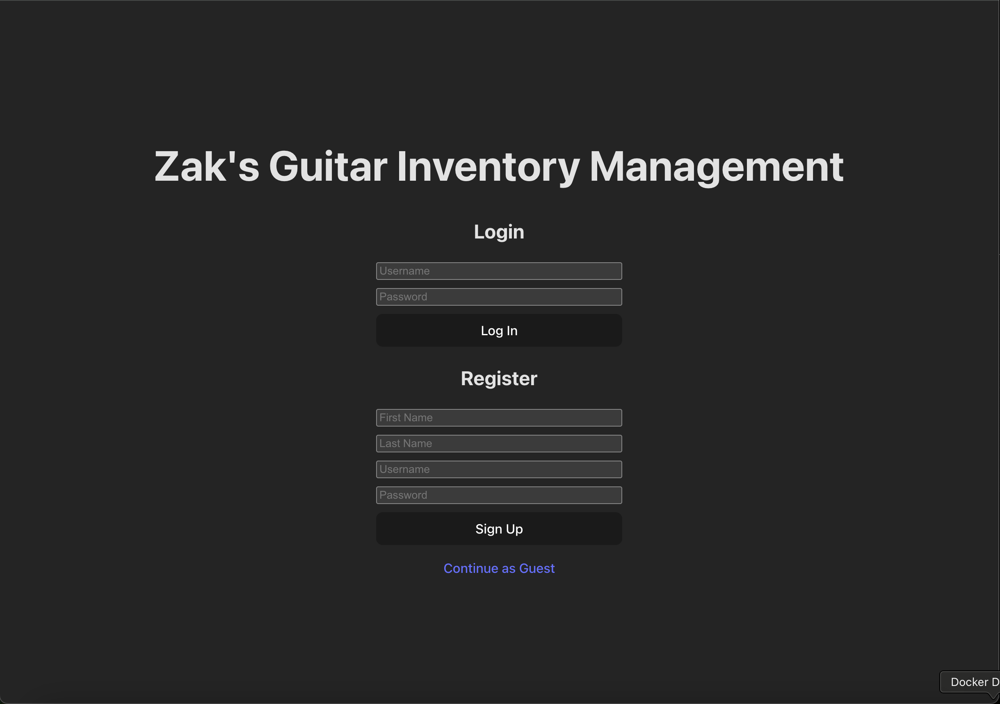
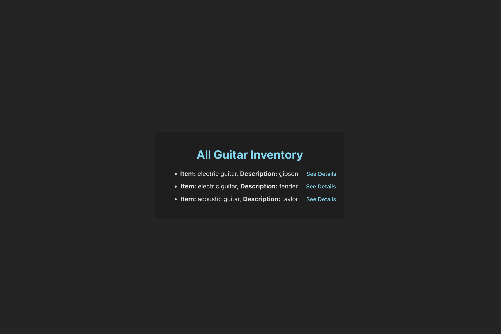
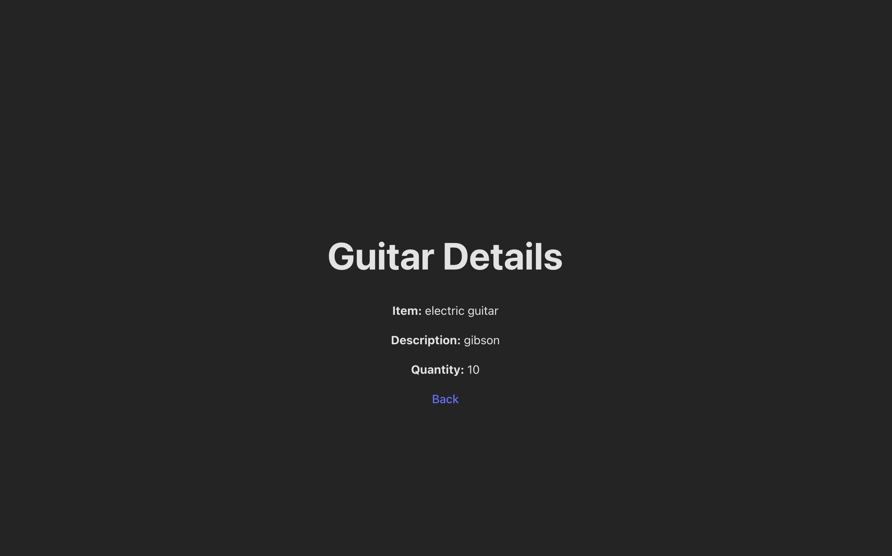
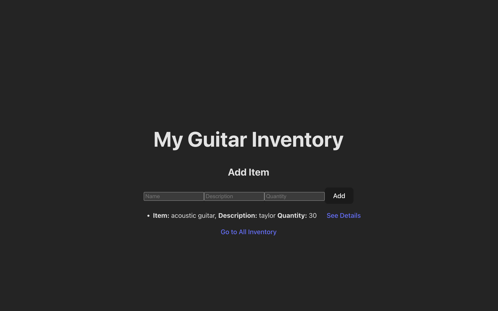
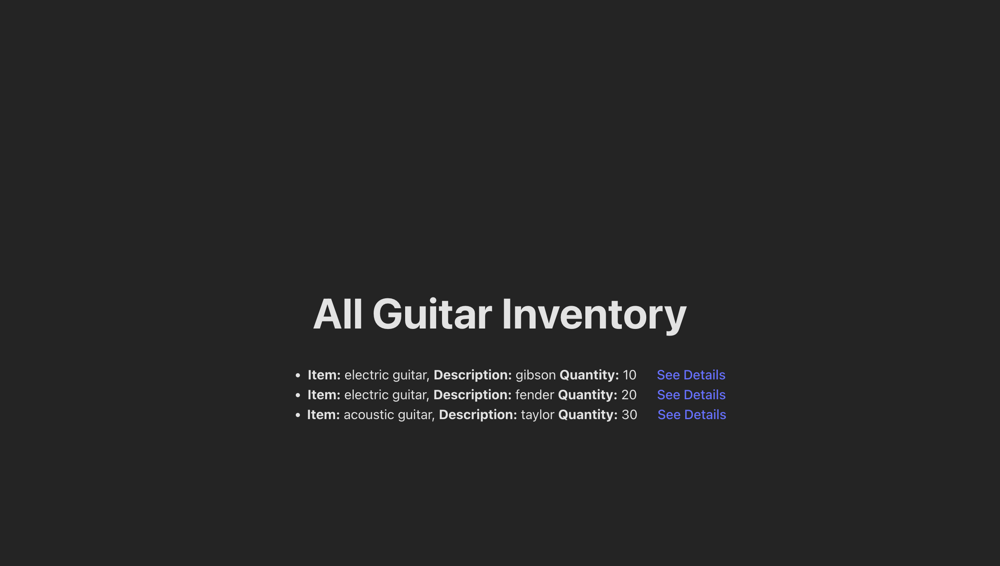

# Clone This Repo

- https://github.com/zchapman24/z-prefix-crud-app.git

# What this application is

- This application allows inventory managers at your local guitar shop to track, add, and delete their inventory. Guests may also use this application to see the current guitars in stock.

# Technology Used For This Application

- PERN Stack
- POSTGRESQL, EXPRESSjs, React + vite, Node js
- Docker

# IMPORTANT THINGS TO NOTE

- Reference the "knexfile.js" for important database connection information such as: client, connection, host, port, database name, user, password
- If the page gives errors, refresh a bunch of times and go back to the home page

# Setting Up the Application

1.  **Database** - Ensure docker desktop is running - In terminal, type docker pull postgres (pulls down a dockerized postgres image from the cloud) - copy/paste this cmd in your terminal mkdir -p $HOME/docker/volumes/postgres - cd into application root directory - copy/paste this command to build the docker container:

        docker run --rm --name pg-docker -e POSTGRES_PASSWORD=docker -d -p 5432:5432 \

    -v $HOME/docker/volumes/postgres:/var/lib/postgresql/data postgres

    - docker ps -a to see running/non running containers
    - docker exec -it <PSQL-Container-ID> bash
    - psql -U postgres
    - \list to see current databases
    - CREATE DATABASE guitar;
    - \c guitar;
    - Congrats, you are now connected to the guitar database our backend will create the tables and seed data for

2.  **Backend**

    - **In a 2nd running terminal**
    - cd into api/
    - npm install
    - npm start
    - In a browser, go to localhost:8080
    - Congrats, your server is running

3.  **Frontend**
    - **In a 3rd running terminal**
    - cd into ui/
    - npm install
    - npm run dev
    - In a 2nd browser window, go to http://localhost:5173/
    - Congrats, your application is fully up and running!

# How It Works

- **Home Page**
  

  - You may continue as a guest to see the current guitar inventory
  - If you're an inventory manager then you need to register an account before you can login

- **Guest View**
  

  - Here you can view the current inventory as a guest without having to log in
  - Click the "see details" link to see the specific information about a particular guitar

- **See Details Page**
  

  - See guitar details here
  - Can edit the details after it gets added
  - Can delete an inventory item

- **Inventory Manager Page**
  

  - This view shows only the inventory that specific inventory manager added
  - Can add new inventory
  - Each inventory manager has the ability to Go to all inventory to see inventory added from other managers

- **All Inventory Page**
  

  - Here you can find all inventory added by all inventory managers as well as the details for each item

# React + Vite

This template provides a minimal setup to get React working in Vite with HMR and some ESLint rules.

Currently, two official plugins are available:

- [@vitejs/plugin-react](https://github.com/vitejs/vite-plugin-react/blob/main/packages/plugin-react) uses [Babel](https://babeljs.io/) for Fast Refresh
- [@vitejs/plugin-react-swc](https://github.com/vitejs/vite-plugin-react/blob/main/packages/plugin-react-swc) uses [SWC](https://swc.rs/) for Fast Refresh

## Expanding the ESLint configuration

If you are developing a production application, we recommend using TypeScript with type-aware lint rules enabled. Check out the [TS template](https://github.com/vitejs/vite/tree/main/packages/create-vite/template-react-ts) for information on how to integrate TypeScript and [`typescript-eslint`](https://typescript-eslint.io) in your project.
